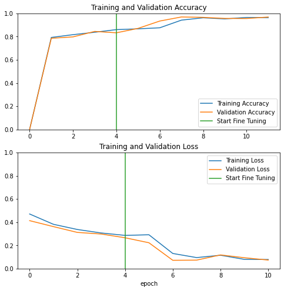

# Breast-Cancer-Detection
Creating a Breast Cancer Detection model doing transfer learning from Resnet101v2 

This project was originally meant to have it running directly from Google Colab with MLflow, however, due to speed and computing resources are limited using Colab, it was adapted to run on a local server from school.

# Steps
## Data load
We first retrieve all data from a dataset provided by [Computer Science department (IC / UFF) work in Visual Lab](http://visual.ic.uff.br/dmi/).
This dataset includes aroung 5,000 images with women classified as healthy or sick. We would split this images in a 70% for training and the remaining for our validation dataset.

## Data Preprocess
For this task a function call data_augmenter() was created, which will come handy later on. Also the dataset was preprocessed as resnet arquitecture, so it's matches our model.

## Creating a model
First we will apply our data_augmentation(), next will be preprocessing each picture, and add some final layers to our model.
The hyperparameters used along with it are shown in the picture below.

## First training
We trained for 5 epochs and set an EarlyStopping with patience = 10. Accuracy resulting from it it around 85%, pretty good, but it can get better.

## Fine tuning
In order to improve our model we can do some transfer learning by freezing first 300 layers and retraining all the other ones. So we did, followed by another 5 more epochs set for training. Proving fine tuning done works, our accuracy improved up to 95%.

# Results

# Visualising model details with MLflow
By this point there's a folder called **mlruns** on the root directy where we executed this code, right there we could run the command *mlflow ui* which will allocate MLflow's interface on http://localhost:5000/. Now we should be able to take a look at our model parameters and metrics obtained during execution.
